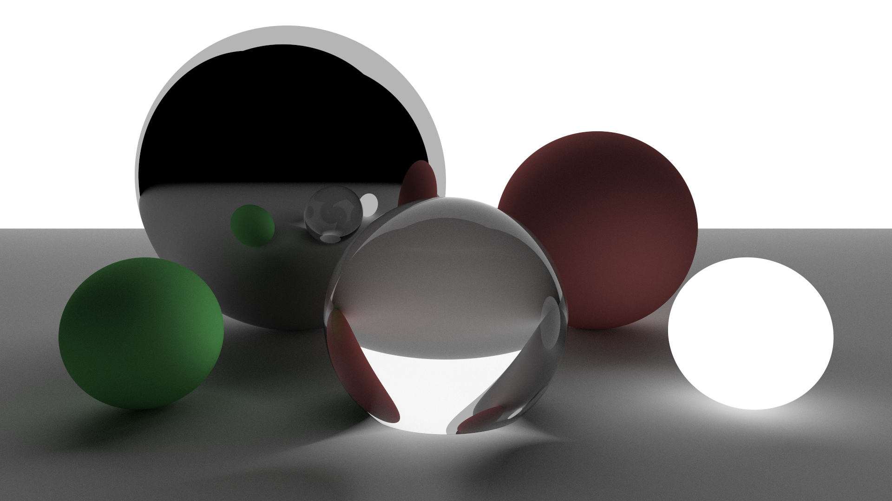

# rtk

  
  
   
  ray-tracing kiwis
   

This is a software ray-tracer based on the books at [raytracing.github.io](https://raytracing.github.io).

## Features

- Render a scene with its camera, objects, and materials described in a toml file. See [examples](examples).

## Usage

- rtk is an ordinary Cargo project. Run `cargo build --release` or `cargo install --path .`.