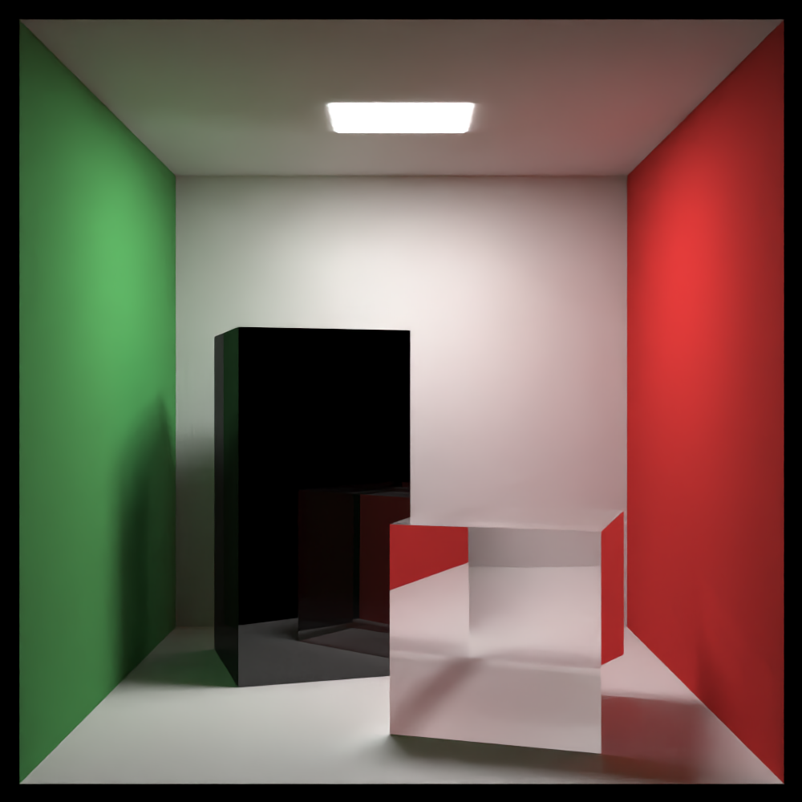

# rtk

<div align="center">
  
  <br />
  ray-tracing kiwis
  <br />
</div>

This is a software ray-tracer based on the books at
[raytracing.github.io](https://raytracing.github.io).

## Features

- Render a scene with its camera, objects, and materials described in a toml file.
  See [examples](examples).
- Parallelized with `rayon`.
  - In testing, `examples/plane_with_spheres.toml` rendered in 7 minutes with `--no-parallel`
    and 70 seconds with `--parallel`, a 6x speed-up.

## Usage

rtk is an ordinary Cargo project. Run `cargo build --release` or `cargo install --path .`.

To render the Cornell box example:

```sh
/target/release/rtk examples/cornell_box.toml
```

### Denoising

`denoise.sh` will quickly denoise an image with
[Intel Open Image Denoise](https://www.openimagedenoise.org/), the same denoising software used by
Blender.

On Arch Linux, the requirements are provided by `extra/imagemagick` and `extra/openimagedenoise`.

To denoise `image.png`:

```sh
./denoise.sh image.png
```

|  |  |
|--|--|
| Raw | Denoised |
